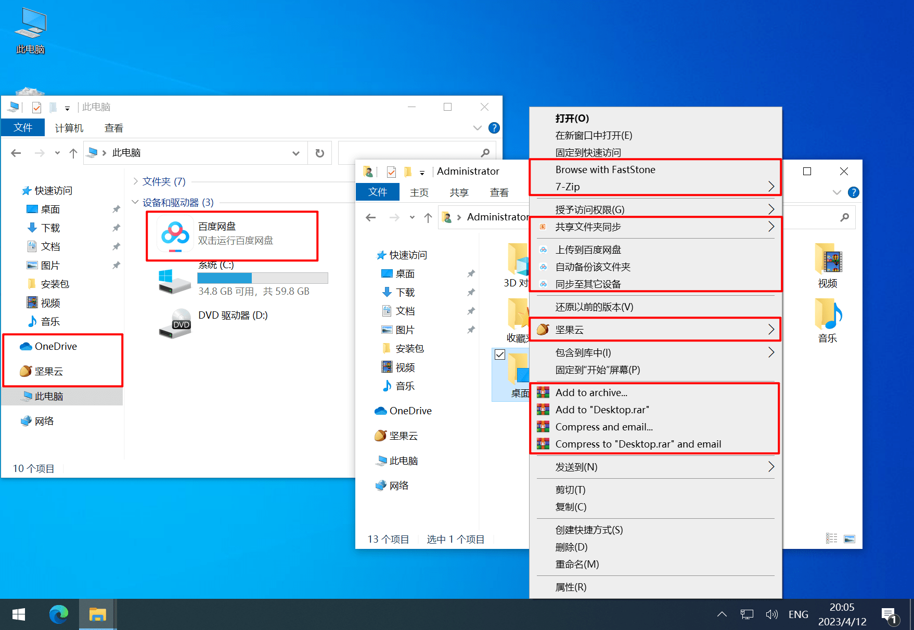
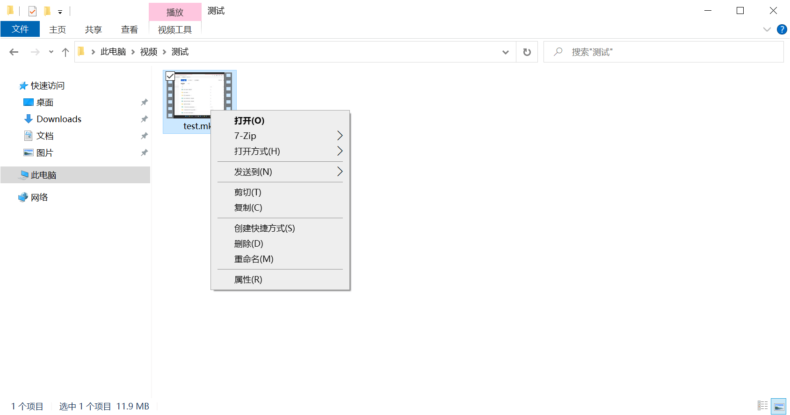
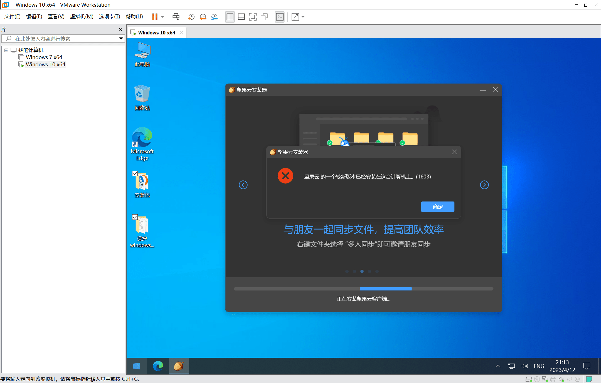
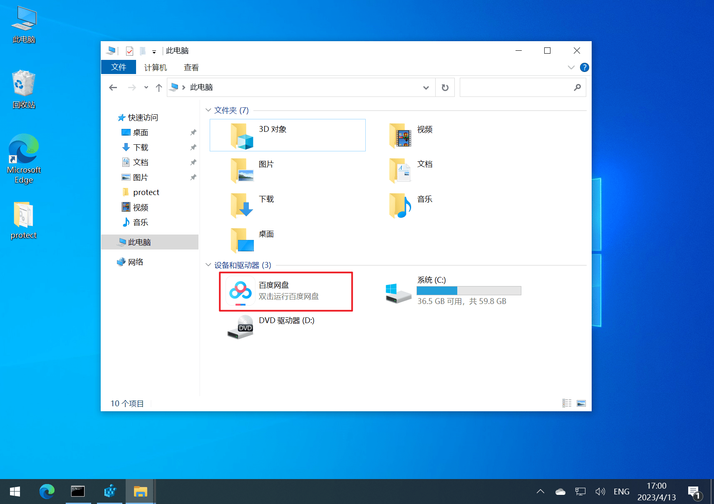
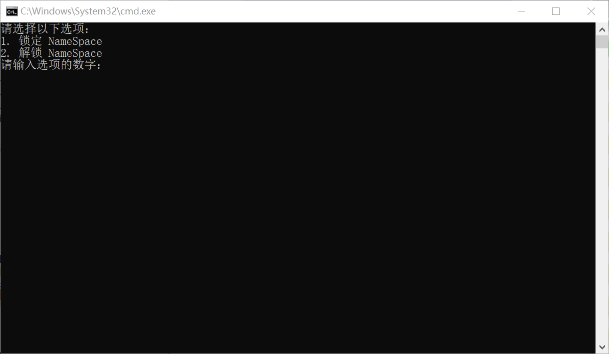
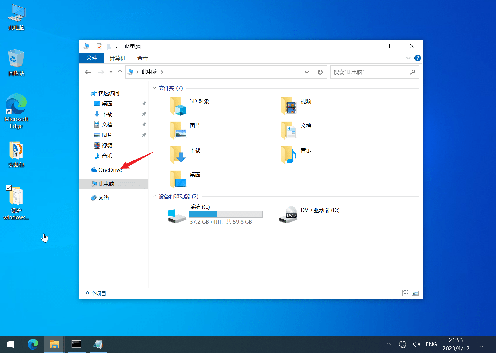

## 01-保护右键菜单

许多第三方软件非常不老实，在安装后，总会在右键菜单、资源管理器中夹带私货，例如：

- 安装百度网盘后，它会在右键菜单中添加「上传到百度网盘」，在资源管理器中添加「百度网盘」
- 安装 QQ 后，它会在右键菜单添加「发送到百度网盘」
- 每次启动 OneDrive 它都会在右键菜单添加「移动到 OneDrive」
- ……

 

眼花先不说，许多软件的右键菜单项目，竟然还会影响右键弹出速度，甚至这些添加项都没有任何选项禁用掉，是可忍，孰不可忍。

这些软件是通过修改注册表，实现添加右键菜单和资源管理器图标的。

虽然可以使用 [Context Menu Manager](https://ld246.com/forward?goto=https%3A%2F%2Fgithub.com%2FBluePointLilac%2FContextMenuManager) 右键菜单管理工具进行管理，但我更希望直接禁止第三方软件添加右键菜单，我决定一步到位，修改注册表权限，断了他们的路。

主要原理就是，把右键菜单相关的注册表写权限全部禁止，仅仅保留 SYSTEM 的最高权限，这样，即便软件获取了管理员权限，也无法写右键菜单。

当然，因为保留了 SYSTEM 的写权限，我们还可以把写权限改回来，在需要的时候修改右键菜单。

用管理员身份双击 `01-保护右键菜单.bat` 运行后，按照提示操作即可：

 

总共修改了以下项的权限：

```
# 文件右键，针对所有类型文件
HKEY_CLASSES_ROOT\*\shell
HKEY_CLASSES_ROOT\*\shellex\ContextMenuHandlers

# 快捷方式右键，OneDrive 钟爱
HKEY_CLASSES_ROOT\lnkfile\shellex\ContextMenuHandlers

# URL 快捷方式右键，OneDrive 钟爱
HKEY_CLASSES_ROOT\IE.AssocFile.URL\shellex\ContextMenuHandlers

# 目录右键
HKEY_CLASSES_ROOT\Directory\shell
HKEY_CLASSES_ROOT\Directory\shellex\ContextMenuHandlers

# 目录背景右键
HKEY_CLASSES_ROOT\Directory\Background\shell
HKEY_CLASSES_ROOT\Directory\Background\shellex\ContextMenuHandlers

# 文件夹扩展菜单
HKEY_CLASSES_ROOT\Folder\shell
HKEY_CLASSES_ROOT\Folder\shellex\ContextMenuHandlers

# 桌面右键
HKEY_CLASSES_ROOT\DesktopBackground\Shell
HKEY_CLASSES_ROOT\DesktopBackground\Shellex\ContextMenuHandlers

# 所有对象
HKEY_CLASSES_ROOT\AllFilesystemObjects\shell
HKEY_CLASSES_ROOT\AllFilesystemObjects\shellex\ContextMenuHandlers

# 磁盘右键
HKEY_CLASSES_ROOT\Drive\shell
HKEY_CLASSES_ROOT\Drive\shellex\ContextMenuHandlers
```

配合 [Context Menu Manager](https://ld246.com/forward?goto=https%3A%2F%2Fgithub.com%2FBluePointLilac%2FContextMenuManager) 右键菜单管理工具可以把右键菜单管理的井井有条：




---

这个方法可以阻止大部分软件的右键污染操作，但是有些软件如果在安装时无法在注册表写右键菜单，它就会安装失败。只能说一个字，绝！

比如坚果云的安装包就会提示「坚果云的一个较新版本已经安装在这台计算机上 (1603)」，拒绝安装：

 

## 02-保护 Explorer 盘符

也是通过修改注册表权限的方式，阻止第三方软件在资源管理器里面随便加这样的图标：

   

使用管理员权限运行 `02-保护Explorer盘符.bat` ，按照提示操作即可：

 

总共修改了以下项的权限：

```
# 资源管理器盘符图标
HKEY_CURRENT_USER\Software\Microsoft\Windows\CurrentVersion\Explorer\MyComputer
HKEY_CURRENT_USER\Software\Microsoft\Windows\CurrentVersion\Explorer\MyComputer\NameSpace

# 选择文件夹窗口盘符图标
HKEY_CURRENT_USER\SOFTWARE\Microsoft\Windows\CurrentVersion\Explorer\Desktop\NameSpace
```

## 03-删除OneDrive导航窗格图标

就是用于删除资源管理器导航栏的这个 OneDrive 图标：

 

使用管理员权限运行 `03-删除OneDrive导航窗格图标.bat` ，即可删除

## 04-删除OneDrive右键菜单

用于一键删除右键菜单中的 OneDrive 项，它共有5项，在 [Context Menu Manager](https://ld246.com/forward?goto=https%3A%2F%2Fgithub.com%2FBluePointLilac%2FContextMenuManager) 里面操作管理也挺麻烦的，直接做成了脚本，一键删除。

使用管理员权限运行 `04-删除OneDrive右键菜单.bat` ，即可。

OneDrive 每次启动都会自动把删掉的右键菜单加回来，可以使用上面的 `01-保护右键菜单.bat` 进行保护。
